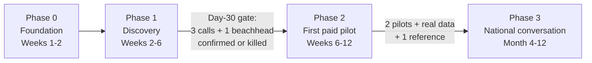

# Bloodchain 90-day plan

Milestone-gated. Each phase has a gate; do not start the next phase until the gate is met. Engineering stays subordinate to discovery — no scope expansion until a beachhead signs.

---

## Phase 0 — Foundation (Weeks 1–2)

| # | Action | Owner | Done when |
|---|--------|-------|-----------|
| 1 | Register legal entity (PTY LTD) | Leadership | Certificate issued; can sign a contract |
| 2 | Stabilise hosting | Eng | API health green; `bloodchain.life` styled and complete |
| 3 | Recover collateral into repo | Eng | `docs/outreach/` populated (done) + PPTX decks saved to shared drive |
| 4 | Scrub demo users + set SUPER_ADMIN | Eng | `giftjrnakedi@gmail.com` is `SUPER_ADMIN` in Supabase + Postgres |
| 5 | Name one clinical champion | Leadership | A clinician will vouch for a pilot |

**Gate:** entity exists, site is live, an admin account works, a clinical name is secured.

---

## Phase 1 — Customer discovery (Weeks 2–6)

Run the six conversations in `assumptions-log.md`. Listen, do not pitch.

**Day-30 gate:** at least 3 discovery calls completed; one beachhead confirmed or killed.

Send order: **BLB first** (unanimous "start here"), then the warm hospital/Baylor contacts.

---

## Phase 2 — First beachhead pilot (Weeks 6–12)

Use `pilots.md`. Default priority if discovery confirms assumptions:

1. **Scyther + Azure -> Blood for Life Botswana** (default)
2. Parallel if warm: **Transfuse -> Gaborone Private Hospital**
3. Parallel if Baylor confirms paper: **Chronicle -> Baylor** (50 patients, 90 days, narrow)

**Do not lead with:** NBTS national licence, BMRA Sentinel sale, Helix standalone, High Command to MoH.

**Gate:** one signed paid pilot delivering real data, or a documented kill + pivot.

---

## Phase 3 — National conversation (Month 4–12)

- Two pilots producing real data -> populate High Command KPIs.
- References + revenue (target: 3 paying customers).
- Then approach MoH / NBTS with numbers, not an empty dashboard.
- Position MEDITECH as the headquarters incumbent; Bloodchain fills NGO, private, district, and hospital gaps.

---

## Capital / network ask

| Ask | Detail |
|-----|--------|
| Capital | ~**P150,000**, milestone-gated: discovery -> one paid pilot -> entity/legal |
| Network | BLB introduction; Baylor clinical lead; Diagnofirm or BDF Medical contact; US Embassy PEPFAR/CDC path only if needed |
| Use of funds | Entity registration, hosting, pilot delivery, part-time clinical advisory |

---

## Single-sentence strategy

**Sell three small, paying beachheads (BLB, one private hospital, Baylor or a private lab); let their data and references unlock the national Bloodchain conversation — not the other way around.**
